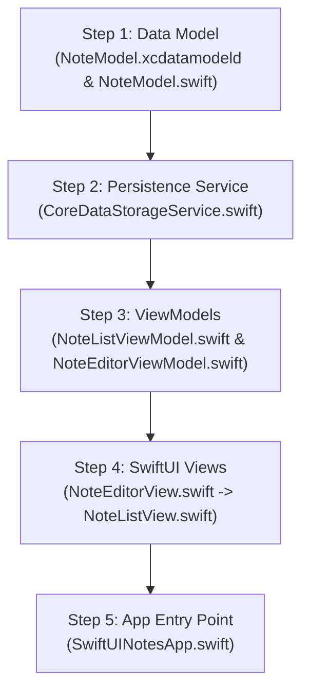

Listed directory SwiftUINotesApp
Listed directory SwiftUINotesApp
Listed directory Models
Listed directory Services
Listed directory ViewModels
Listed directory Views
Listed directory App
Viewed NoteModel.swift:1-100
Viewed CoreDataStorageService.swift:1-100
Viewed NoteListViewModel.swift:1-60
Viewed NoteEditorViewModel.swift:1-60
Viewed SwiftUINotesApp.swift:1-49
Viewed NoteListView.swift:1-60
Viewed NoteEditorView.swift:1-60
Viewed project.yml:1-24

When building this **SwiftUI Notes App** with **MVVM + Core Data** from scratch, the cleanest and most efficient approach is the **Bottom-Up (Dependency-First) Strategy**.

By starting with the lowest-level dependencies (data schema and services) and working up towards the UI, every layer you create will compile immediately without needing fake placeholder stubs or temporary code.

---

### 🗺️ High-Level Order of Implementation

---

## 1. Step 1: The Data Layer (Entities & Models)

### **File 1.1: `NoteModel.xcdatamodeld`**
* **Location:** [Models/NoteModel.xcdatamodeld](file:///Users/sachinkumar/Desktop/projects/SwiftUINotesApp/SwiftUINotesApp/Models/NoteModel.xcdatamodeld)
* **Why first:** Everything in the application depends on what a "Note" is. Without defining the database schema, Core Data cannot generate or manage your entities.
* **What to configure first:**
  1. Add Entity: `NoteEntity`
  2. Add Attributes:
     - `id` : `UUID`
     - `title` : `String`
     - `content` : `String`
     - `timestamp` : `Date`
  3. Module: `Current Product Module`, Codegen: `Manual/None`

---

### **File 1.2: `NoteModel.swift`**
* **Location:** [Models/NoteModel.swift](file:///Users/sachinkumar/Desktop/projects/SwiftUINotesApp/SwiftUINotesApp/Models/NoteModel.swift)
* **Why now:** Provides the Swift class interface for [NoteEntity](file:///Users/sachinkumar/Desktop/projects/SwiftUINotesApp/SwiftUINotesApp/Models/NoteModel.swift#L42-L43) and view-friendly helpers.
* **Ordering of code in this file:**
  1. **Class definition:** `@objc(NoteEntity) public class NoteEntity: NSManagedObject, Identifiable`
  2. **Properties:** `@NSManaged` attributes matching the Core Data schema (`id`, `title`, `content`, `timestamp`).
  3. **Display helpers:** 
     - `displayTitle`: Computed property that falls back to `"Untitled Note"` if empty.
     - `displayDate`: Formats `timestamp` with `DateFormatter` into a readable string (e.g. `"Aug 24, 2026"`).

---

## 2. Step 2: The Service / Persistence Layer

### **File 2: `CoreDataStorageService.swift`**
* **Location:** [Services/CoreDataStorageService.swift](file:///Users/sachinkumar/Desktop/projects/SwiftUINotesApp/SwiftUINotesApp/Services/CoreDataStorageService.swift)
* **Why next:** The ViewModels need a safe, centralized manager to access the database context and save changes to disk.
* **Ordering of code in this file:**
  1. **Singleton instance:** `static let shared = CoreDataStorageService()`
  2. **Container property:** `let container: NSPersistentContainer`
  3. **Context shortcut:** `var context: NSManagedObjectContext { container.viewContext }`
  4. **Initializer:** `init(inMemory: Bool = false)`:
     - Load persistent stores from `"NoteModel"`.
     - Support `inMemory = true` for unit tests and SwiftUI Previews.
  5. **Persistence method:** `func saveContext()`:
     - Check `if context.hasChanges` before saving inside a `do-try-catch` block.

---

## 3. Step 3: The ViewModels (Business & Presentation Logic)

### **File 3.1: `NoteListViewModel.swift`**
* **Location:** [ViewModels/NoteListViewModel.swift](file:///Users/sachinkumar/Desktop/projects/SwiftUINotesApp/SwiftUINotesApp/ViewModels/NoteListViewModel.swift)
* **Why now:** Drives the main list screen without being tied to UI layout details.
* **Ordering of code in this file:**
  1. **Class definition:** `class NoteListViewModel: ObservableObject`
  2. **State properties:** `@Published var notes: [NoteEntity] = []`
  3. **Service dependency:** `private let storageService = CoreDataStorageService.shared`
  4. **Fetch logic:** `func fetchNotes()`:
     - Create `NSFetchRequest<NoteEntity>`.
     - Sort by `timestamp` descending (`ascending: false`).
     - Execute fetch and assign to `self.notes`.
  5. **Delete logic:** `func deleteNote(at indexSet: IndexSet)`:
     - Delete selected note from context, call `saveContext()`, then reload `fetchNotes()`.
  6. **Initializer:** `init()` calling `fetchNotes()`.

---

### **File 3.2: `NoteEditorViewModel.swift`**
* **Location:** [ViewModels/NoteEditorViewModel.swift](file:///Users/sachinkumar/Desktop/projects/SwiftUINotesApp/SwiftUINotesApp/ViewModels/NoteEditorViewModel.swift)
* **Why now:** Manages form validation, editing existing notes, and creating new notes.
* **Ordering of code in this file:**
  1. **Class definition:** `class NoteEditorViewModel: ObservableObject`
  2. **State & bindings:** `@Published var title: String = ""` and `@Published var content: String = ""`
  3. **Model reference:** `private var note: NoteEntity?`
  4. **Initializer:** `init(note: NoteEntity? = nil)`:
     - Store the note; if editing an existing note, prefill `title` and `content`.
  5. **Save logic:** `func saveNote()`:
     - If `note == nil`, instantiate a new `NoteEntity` with `UUID()` and `Date()`.
     - Update `title`, `content`, and updated `timestamp`.
     - Call `storageService.saveContext()`.
  6. **UI Helper:** `var navigationTitle: String` (`"Edit Note"` vs `"New Note"`).

---

## 4. Step 4: The Views (SwiftUI UI Layer)

> **Pro Tip on View Ordering:** Write **[NoteEditorView](file:///Users/sachinkumar/Desktop/projects/SwiftUINotesApp/SwiftUINotesApp/Views/NoteEditorView.swift)** before **[NoteListView](file:///Users/sachinkumar/Desktop/projects/SwiftUINotesApp/SwiftUINotesApp/Views/NoteListView.swift)**. Since `NoteListView` uses `NavigationLink` pointing to `NoteEditorView`, having the editor view already written avoids compiler errors.

### **File 4.1: `NoteEditorView.swift`**
* **Location:** [Views/NoteEditorView.swift](file:///Users/sachinkumar/Desktop/projects/SwiftUINotesApp/SwiftUINotesApp/Views/NoteEditorView.swift)
* **Ordering of code in this file:**
  1. **Environment & State properties:**
     - `@Environment(\.dismiss) private var dismiss`
     - `@StateObject private var viewModel: NoteEditorViewModel`
     - `var onSave: (() -> Void)?` (callback to notify parent list).
  2. **Initializer:** `init(note: NoteEntity? = nil, onSave: (() -> Void)? = nil)` to initialize `@StateObject`.
  3. **Body layout:**
     - `Form` containing a `Section("Title") { TextField(...) }` and `Section("Content") { TextEditor(...) }`.
  4. **Toolbar:**
     - Top-trailing "Save" button that triggers `viewModel.saveNote()`, executes `onSave?()`, and calls `dismiss()`.

---

### **File 4.2: `NoteListView.swift`**
* **Location:** [Views/NoteListView.swift](file:///Users/sachinkumar/Desktop/projects/SwiftUINotesApp/SwiftUINotesApp/Views/NoteListView.swift)
* **Ordering of code in this file:**
  1. **StateObject:** `@StateObject private var viewModel = NoteListViewModel()`
  2. **Body layout:**
     - `NavigationStack` wrapping `List`.
     - `ForEach(viewModel.notes)` with a `NavigationLink` navigating to `NoteEditorView(note: note, onSave: { viewModel.fetchNotes() })`.
     - Row styling displaying `note.displayTitle` and `note.displayDate`.
     - `.onDelete(perform: viewModel.deleteNote)`.
  3. **Empty state:** Friendly overlay message when `viewModel.notes.isEmpty`.
  4. **Toolbar & Modifiers:**
     - Top-trailing `+` button navigating to `NoteEditorView(onSave: { viewModel.fetchNotes() })`.
     - `.onAppear { viewModel.fetchNotes() }`.

---

## 5. Step 5: App Entry Point

### **File 5: `SwiftUINotesApp.swift`**
* **Location:** [App/SwiftUINotesApp.swift](file:///Users/sachinkumar/Desktop/projects/SwiftUINotesApp/SwiftUINotesApp/App/SwiftUINotesApp.swift)
* **Why last:** With all models, view models, and views in place, you simply connect the root view to the app scene.
* **Ordering of code in this file:**
  1. `@main struct SwiftUINotesApp: App`
  2. `var body: some Scene { WindowGroup { NoteListView() } }`

---

### 📋 Summary Checklist

| Step | Target File | Core Purpose |
|---|---|---|
| **1** | [NoteModel.xcdatamodeld](file:///Users/sachinkumar/Desktop/projects/SwiftUINotesApp/SwiftUINotesApp/Models/NoteModel.xcdatamodeld) & [NoteModel.swift](file:///Users/sachinkumar/Desktop/projects/SwiftUINotesApp/SwiftUINotesApp/Models/NoteModel.swift) | Define data fields & display helpers |
| **2** | [CoreDataStorageService.swift](file:///Users/sachinkumar/Desktop/projects/SwiftUINotesApp/SwiftUINotesApp/Services/CoreDataStorageService.swift) | Persistent container, context & saving |
| **3** | [NoteListViewModel.swift](file:///Users/sachinkumar/Desktop/projects/SwiftUINotesApp/SwiftUINotesApp/ViewModels/NoteListViewModel.swift) & [NoteEditorViewModel.swift](file:///Users/sachinkumar/Desktop/projects/SwiftUINotesApp/SwiftUINotesApp/ViewModels/NoteEditorViewModel.swift) | Data fetching, deletion, and note saving logic |
| **4** | [NoteEditorView.swift](file:///Users/sachinkumar/Desktop/projects/SwiftUINotesApp/SwiftUINotesApp/Views/NoteEditorView.swift) & [NoteListView.swift](file:///Users/sachinkumar/Desktop/projects/SwiftUINotesApp/SwiftUINotesApp/Views/NoteListView.swift) | Forms, lists, navigation & swipe-to-delete |
| **5** | [SwiftUINotesApp.swift](file:///Users/sachinkumar/Desktop/projects/SwiftUINotesApp/SwiftUINotesApp/App/SwiftUINotesApp.swift) | Launch the root `NoteListView` on startup |