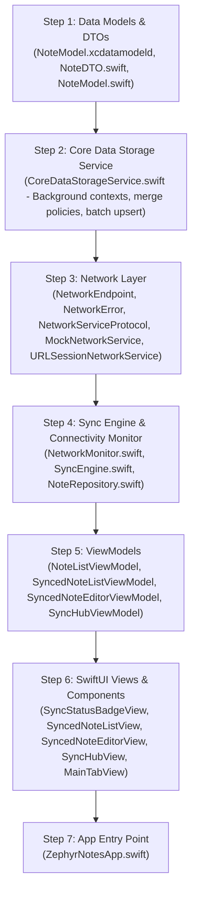

# Zephyr Notes App — Implementation & Architectural Guide

This document details the **Bottom-Up (Dependency-First) Implementation Strategy** followed for building the **SwiftUI + Core Data + Offline-First Network Layer with Bi-Directional Synchronization Engine**.

---

### 🗺️ High-Level Order of Implementation

---

## 1. Step 1: Data Layer & Entities

- **`NoteModel.xcdatamodeld`**: Configured with attributes: `id` (UUID), `title` (String), `content` (String), `timestamp` (Date), `syncStatus` (String), `updatedAt` (Date), `isDeletedLocally` (Boolean), `serverVersion` (Integer 32).
- **`NoteDTO.swift`**: `Codable`, `Sendable`, `Identifiable` DTO for JSON serialization over network with custom ISO8601 formatting and seed mock data.
- **`NoteModel.swift`**: Core Data entity class with typed `SyncStatus` enum (`synced`, `pendingCreate`, `pendingUpdate`, `pendingDelete`), display helpers (`displayTitle`, `displaySnippet`, `displayDate`, `statusBadgeColor`, `statusIconName`), and conversion helpers (`toDTO()`, `update(from:)`).

---

## 2. Step 2: Persistence Layer Optimizations

- **`CoreDataStorageService.swift`**:
  - `NSPersistentContainer` with automatic lightweight migration.
  - `viewContext.automaticallyMergesChangesFromParent = true`.
  - `viewContext.mergePolicy = NSMergeByPropertyObjectTrumpMergePolicy`.
  - Background context generator `newBackgroundContext()` and `performBackgroundTask`.
  - Optimized batch upserting (`batchUpsert(dtos:)`) to prevent main thread stutters.
  - Outbox queries (`fetchPendingSyncNotes()`) and soft-delete / tombstone handling (`markForDeletion()`, `permanentlyDeleteNote()`).

---

## 3. Step 3: Network Layer

- **`NetworkEndpoint.swift`**: Type-safe REST endpoints (`fetchAllNotes`, `fetchNote(id:)`, `createNote`, `updateNote`, `deleteNote`, `batchSync`), HTTP methods (`GET`, `POST`, `PUT`, `DELETE`), and URLRequest builders.
- **`NetworkError.swift`**: Descriptive typed errors (`noInternetConnection`, `serverError`, `decodingError`, `invalidURL`, `timeout`, `notFound`).
- **`NetworkServiceProtocol.swift`**: Protocol defining async/await networking contracts.
- **`MockNetworkService.swift`**: Thread-safe in-memory `actor` mock server simulating cloud state, JSON encoding/decoding, network latency (`Task.sleep`), offline mode toggle, and raw JSON export.
- **`URLSessionNetworkService.swift`**: Production REST client using Apple's `URLSession`.

---

## 4. Step 4: Sync Engine & Connectivity Monitor

- **`NetworkMonitor.swift`**: Background network reachability observer using Apple's `NWPathMonitor` with a developer toggle to simulate offline mode in Xcode Simulator.
- **`SyncEngine.swift`**: Central bi-directional sync coordinator:
  - **Outbox Push**: Traverses pending creations, updates, and deletes to push them to the server.
  - **Inbox Pull**: Fetches fresh remote notes and performs off-main-thread batch upserts.
  - **Auto-Sync on Reconnect**: Combine-powered listener that automatically runs synchronization when connectivity transitions to online.
- **`NoteRepository.swift`**: Clean Repository facade offering optimistic local writes in `<1ms` and automatic background network synchronization.

---

## 5. Step 5 & 6: ViewModels and SwiftUI Views

- **`SyncedNoteListView.swift` & `SyncedNoteListViewModel.swift`**:
  - Cloud notes screen featuring a live connectivity banner, search filtering, pull-to-refresh (`.refreshable`), sync status badges, and swipe-to-delete.
- **`SyncedNoteEditorView.swift` & `SyncedNoteEditorViewModel.swift`**:
  - Note editor with live sync status hints and instant local-first saves.
- **`NoteListView.swift` & `NoteEditorView.swift`**:
  - Standalone local Core Data tab views.
- **`SyncHubView.swift` & `SyncHubViewModel.swift`**:
  - Dedicated diagnostics dashboard with network simulator switch, live sync engine metrics, pending outbox inspector, and raw mock server JSON viewer.
- **`MainTabView.swift`**:
  - Bottom Tab bar presenting:
    1. ☁️ **Cloud Notes** (Offline-First Network + Core Data)
    2. 📝 **Local Notes** (Classic Standalone Core Data)
    3. 🛰️ **Sync Hub** (Network Simulator & Diagnostics)

---

## 6. Step 7: App Entry Point

- **`ZephyrNotesApp.swift`**: App root launching `MainTabView` with initialized Core Data and Sync services.
